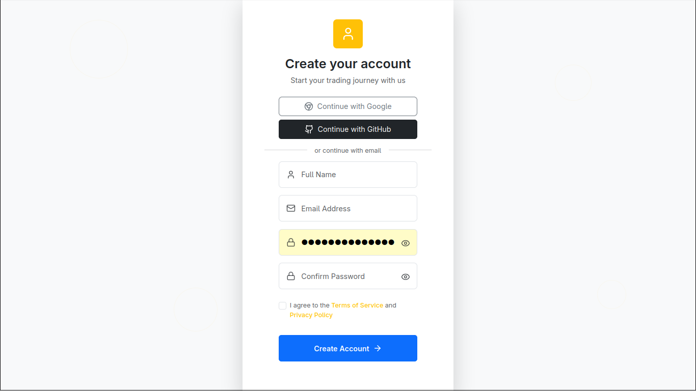
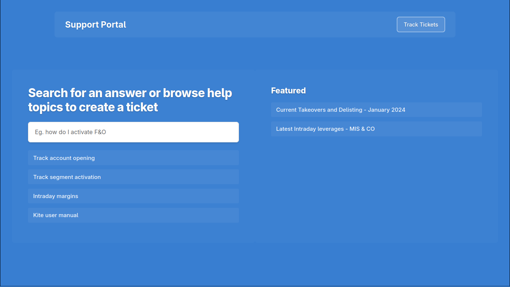
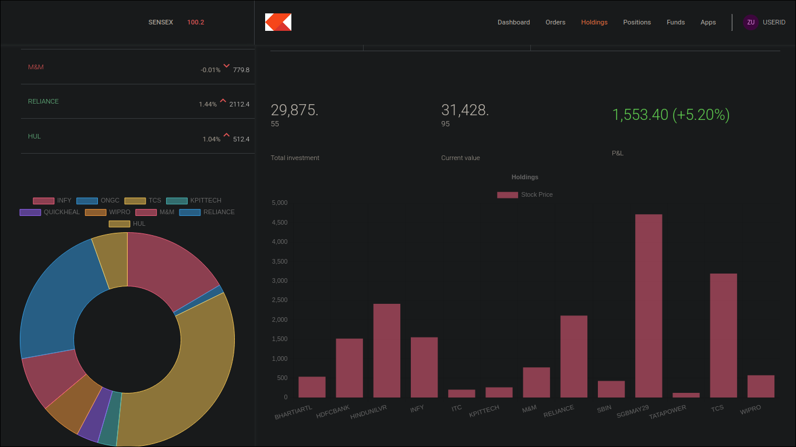
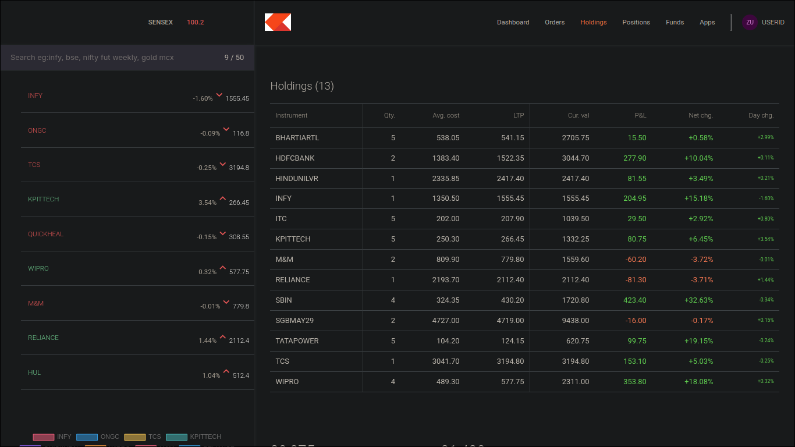

# Full-Stack Trading Dashboard

*A MERN stack application with a data-rich dashboard and Express.js backend.*

---

## 🚀 Live Demo

**[View Live Project](https://68908289f203470008be8ff0--silly-lebkuchen-31391e.netlify.app/)**

> **Note:** You must sign up on the site to access the user dashboard.

---

## Overview

Welcome to the Trading Dashboard project! This is a comprehensive full-stack application built with the MERN (MongoDB, Express.js, React, Node.js) stack. The backend is a robust Express.js API that handles all data operations, while the frontend is a dynamic and responsive user interface designed to provide a seamless user experience.

## 🛠️ Technology Stack

- **Backend:** Node.js, Express.js, Mongoose
- **Frontend:** React.js, React Router DOM
- **Database:** MongoDB Atlas
- **Styling:** Bootstrap
- **Data Visualization:** Chart.js
- **State Management:** React Context API

## ✨ Key Features

- **Full-Stack Architecture:** A complete MERN stack implementation from database to UI.
- **Interactive Dashboard:** Users can sign up to view a personalized dashboard displaying their portfolio data.
- **Rich Data Visualization:** Utilizes **Chart.js** to render beautiful and informative doughnut charts and histograms for financial data analysis.
- **Client-Side Routing:** Employs **React Router DOM** for a smooth, single-page application (SPA) experience with seamless navigation.
- **Centralized State Management:** The **React Context API** is used to manage global state for features like the buy/sell functionality, ensuring predictable state flow.
- **Responsive Design:** Styled with **Bootstrap** to ensure the application is fully responsive and looks great on all devices, from desktops to mobile phones.

## 📸 Screenshots

Here are a few snapshots of the application:
<table>
  <tr>
    <td align="center"><strong>Login/Signup Page</strong></td>
    <td align="center"><strong>Support Page</strong></td>
  </tr>
  <tr>
    <td></td>
    <td></td>
  </tr>
  <tr>
    <td align="center"><strong>Portfolio Chart</strong></td>
    <td align="center"><strong>Holdings Analysis</strong></td>
  </tr>
  <tr>
    <td></td>
    <td></td>
  </tr>
</table>

## ⚙️ How to Run Locally

To get a local copy up and running, follow these simple steps:

### 1. Clone the repository

```bash
git clone https://github.com/your-username/your-repo-name.git
```

### 2. Navigate to Project Folders & Install Dependencies

This project has three main folders: `frontend`, `dashboard`, and `backend`. You need to install dependencies for each one.

```bash
cd frontend
npm install

cd ../dashboard
npm install

cd ../backend
npm install
```

### 3. Set Up Environment Variables

In the `backend` directory, create a new file named `.env`:

```bash
# backend/.env
MONGO_URL=your_mongodb_connection_string_here
```

Replace `your_mongodb_connection_string_here` with your actual connection string from MongoDB Atlas.

### 4. Run the Development Servers

Open three separate terminal windows, one for each folder, and run the start commands:

```bash
# Terminal 1: In the /frontend directory
npm start

# Terminal 2: In the /dashboard directory
npm start

# Terminal 3: In the /backend directory
npm start
```

## 🔮 Future Work

I plan to continue improving this application with new features. The next major enhancement will be:

- **Secure User Authentication:** Implement robust user authentication and password protection using **bcrypt.js** to hash user passwords before storing them in the database, enhancing security and privacy.
- **Real-time Price Updates:** Integrate WebSocket for real-time stock price updates.

